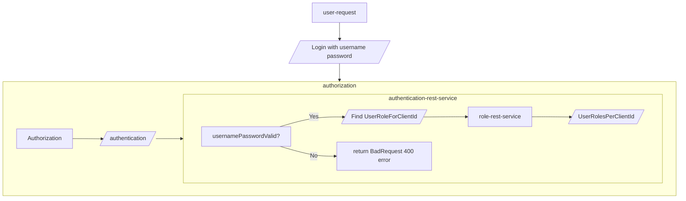

# My Customization of Spring Authorization Server
This is a customization of the Spring Authorization Server which implements OAuth2.1 and OpenID Connect 1.0 specifications.


## Purpose
This authorization service will be used for issuing access-token/refresh tokens for services. 

This application also exposes a rest client for OAuth Client registration at endpoint `clients/`.

This app will communicate with the following two external services:
`authentication-rest-service` for authenticating user with username and password.
`application-rest-service` for getting user roles.

## Run
For running locally using local profile:
`gradle bootRun --args="--spring.profiles.active=local"`

## Build Docker image
Gradle build:
```
./gradlew bootBuildImage --imageName=name/my-spring-authorization-server
```
Docker build passing in username and personal access token varaibles into docker to be used as environment variables in the gradle `build.gradle` file for pulling private maven artifact:
```
docker build --secret id=USERNAME,env=USERNAME --secret id=PERSONAL_ACCESS_TOKEN,env=PERSONAL_ACCESS_TOKEN . -t my/auth-servier
```

Pass local profile as argument:
```
 docker run -e --spring.profiles.active=local -p 9001:9001 -t myorg/myapp
```


## Authentication process


authentication -->roles[/User roles for clientId] --> populateGrantedAuths[/set grantedAuths in UsernamePasswordAuthenticationToken/]
